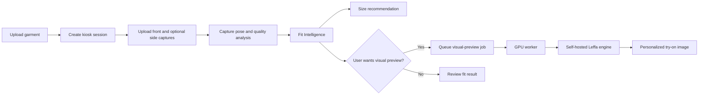

# Virtual Try-On Kiosk MVP

Self-hosted virtual try-on backend for a kiosk flow: garment upload, front/side
user capture, pose and input-quality analysis, Fit Intelligence, and optional
GPU visual preview.

The current production direction is a single GPU server or pod that runs the API,
local worker, local data stores, Ollama multimodal analyzer, and the visual
try-on engine. Remote image-generation providers are kept only for benchmark or
debug paths.

## Current Status

- FastAPI kiosk API with Swagger on port `8080`.
- User-facing static kiosk app UI under `ui/kiosk-demo`.
- Local SQLite registries for garments and size charts.
- Default generic size charts are seeded at API startup when missing.
- Front and optional side capture upload via `multipart/form-data`.
- MediaPipe-based capture quality and pose analysis.
- Fit Intelligence API skeleton with size-chart based recommendations.
- Local JSON job queue with worker abstraction for future Redis/Kafka backends.
- Optional async visual preview job flow for long GPU jobs.
- Self-hosted Leffa visual try-on baseline integrated behind the worker.
- RunPod single-pod deployment path documented and smoke-tested.

Recent GPU baseline:

- RunPod L4 proved the end-to-end API/worker/Leffa path, but latency was too
  high for practical use.
- RTX 3090 completed the same Leffa API job successfully and is the current
  practical baseline for continued evaluation.
- Input conditioning improved output quality, but logo/text sharpness still
  depends heavily on capture framing and garment image quality.

See [docs/development-journal.md](docs/development-journal.md) and
[docs/eval/model-quality-gate-matrix.md](docs/eval/model-quality-gate-matrix.md)
for the latest benchmark notes.

## Architecture



Primary docs:

- [Kiosk GPU flow](docs/architecture/kiosk-gpu-flow.md)
- [Swagger workflow](docs/kiosk-swagger-workflow.md)
- [RunPod deployment runbook](docs/deployment/runpod-kiosk.md)
- [RunPod roadmap](docs/deployment/runpod-roadmap.md)

## Requirements

Local control-plane development:

- Python 3.11+
- `make`
- Writable local `data/` directory

GPU visual-preview deployment:

- Linux GPU host or RunPod pod
- CUDA-compatible PyTorch runtime
- Persistent storage mounted at `/workspace`
- Ollama with `qwen2.5vl:7b-q4_K_M` for multimodal analysis
- Leffa assets installed under `/workspace/tryon-models`

## Quick Start: Local API

```bash
make setup
cp .env.example .env
make run
```

Open Swagger:

```text
http://127.0.0.1:8080/docs
```

For the kiosk-only Swagger surface:

```bash
API_PROFILE=kiosk make run
```

For async visual-preview jobs, run the worker in another terminal:

```bash
make worker
```

Or run API and worker together:

```bash
make run-kiosk-all
```

Serve the kiosk application UI in a separate terminal:

```bash
make ui-kiosk
```

Open:

```text
http://127.0.0.1:5173
```

The UI follows the production kiosk flow instead of mirroring Swagger: upload a
garment with a region size chart, create a session, upload shopper photos, run
capture quality analysis, get Fit Intelligence advice, then optionally queue a
GPU visual-preview job.

Seed the default local kiosk size charts without resetting other data:

```bash
make kiosk-seed-size-charts
```

Reset local runtime test data and import the default size charts again:

```bash
make kiosk-reset
```

## Quick Start: RunPod MVP

Inside the pod:

```bash
cd /workspace
git clone <repo-url> tryon-visual-project
cd /workspace/tryon-visual-project

python3 -m venv venv
source venv/bin/activate
make runpod-install
```

Configure `.env` from `.env.runpod.example`, then start the all-in-one kiosk
process:

```bash
make runpod-start-with-ollama
```

Open:

```text
https://<pod-id>-8080.proxy.runpod.net/docs
```

Preflight:

```bash
make runpod-preflight
python -m scripts.kiosk_preflight --json
```

Reset demo state when needed:

```bash
make runpod-reset
```

## Swagger Workflow

Use this order for manual end-to-end testing:

1. `GET /api/v1/readiness`
2. `GET /api/v1/kiosk/size-charts`
3. `POST /api/v1/kiosk/garments`
4. `POST /api/v1/kiosk/sessions`
5. `POST /api/v1/kiosk/sessions/{session_id}/captures`
6. `POST /api/v1/kiosk/sessions/{session_id}/captures/analyze`
7. `POST /api/v1/kiosk/sessions/{session_id}/fit/analyze`
8. Optional: `POST /api/v1/kiosk/sessions/{session_id}/visual-preview/jobs`
9. Poll: `GET /api/v1/kiosk/jobs/{job_id}`

Use the async visual-preview job endpoint on RunPod. The synchronous visual
preview endpoint can exceed the RunPod/Cloudflare proxy timeout for GPU jobs.
Default size charts are idempotently imported at backend startup, so Swagger and
the demo UI can select a `size_chart_id` before uploading a garment.

Useful response fields for the current kiosk baseline:

- `capture_analysis.quality_gates.category_visual_preview` explains whether the
  capture framing is good enough for the selected garment category.
- `fit_report.quality_gate` summarizes capture, garment image, size chart, and
  measurement readiness for product-style sizing.
- `size_recommendation.shopper_recommendation` contains the concise shopper
  size message, confidence label, and quality-gate status.

## Key Configuration

Start from `.env.example` locally or `.env.runpod.example` on RunPod.

Important variables:

```bash
API_PROFILE=kiosk
DEBUG=true
TEMP_STORAGE_DIR=/workspace/tryon-data
JOB_QUEUE_BACKEND=local
JOB_QUEUE_DIR=/workspace/tryon-data/jobs
SEED_DEFAULT_SIZE_CHARTS_ON_STARTUP=true

OLLAMA_BASE_URL=http://127.0.0.1:11434
TRYON_ANALYZER_OLLAMA_MODEL=qwen2.5vl:7b-q4_K_M

KIOSK_VISUAL_PREVIEW_PROVIDER=local_leffa
LOCAL_LEFFA_TIMEOUT=1800
```

For production-style kiosk testing, prefer `KIOSK_VISUAL_PREVIEW_PROVIDER=local_leffa`.
Replicate/Qwen settings are benchmark/debug paths only.

## Development Commands

```bash
make setup          # Prepare local environment
make install        # Install Python dependencies
make run            # Run API on 127.0.0.1:8080
make run-kiosk      # Run kiosk API on 0.0.0.0:8080
make run-kiosk-all  # Run API + worker in one foreground process
make worker         # Run kiosk worker loop
make worker-once    # Process one queued job
make kiosk-preflight

make test
make lint
make format
make check
```

RunPod helper commands:

```bash
make runpod-help
make runpod-install
make runpod-pull-ollama
make runpod-start-with-ollama
make runpod-preflight
make runpod-reset
make runpod-cuda-report
make runpod-disk-report
```

Model smoke commands:

```bash
make runpod-leffa-smoke-data
make runpod-vton-input-quality RUNPOD_VTON_INPUT_GARMENT_CATEGORY=tops
make runpod-vton-condition-smoke-inputs
make runpod-leffa-conditioned-smoke
make runpod-leffa-upper-body-web-garment-smoke RUNPOD_WEB_GARMENT_ID=2
```

## Project Structure

```text
src/
  main.py                         FastAPI entry point
  api/routes/                     HTTP routes
  api/router_registry.py          API profile routing
  config/settings.py              Environment-driven settings
  modules/
    kiosk_tryon/                  Kiosk sessions, captures, fit, jobs
    image_generator/              Visual preview providers
    jobs/                         Queue backend and worker
    privacy_guard/                Local privacy utilities
    semantic_parser/              Legacy/evaluation analysis paths
  schemas/                        Pydantic schemas

scripts/                          Operational and smoke-test scripts
docs/                             Architecture, deployment, and workflow docs
tests/                            Pytest suite
data/                             Local runtime data and sample fixtures
models/                           Local model placeholders
```

## Privacy And Data

- Runtime user captures, generated images, queues, SQLite files, and model
  caches should stay under `data/` locally or `/workspace/tryon-data` on RunPod.
- Do not commit `.env`, API tokens, runtime images, SQLite databases, or model
  weights.
- The kiosk production direction is self-hosted GPU inference. Any external
  provider path should be treated as an explicit benchmark/debug mode.

## Known Limitations

- Fit Intelligence is still a baseline implementation. It needs stronger
  measurement estimation and calibrated size-chart scoring before production
  size recommendations.
- Leffa currently works best for upper-body garments. Bottoms, one-pieces, and
  full outfits need additional quality-gate testing before being treated as
  production-ready.
- Logo/text sharpness depends on garment image cleanliness and the visible
  torso area in the user capture. Use closer upper-body framing for high-detail
  top previews.
- The local queue is suitable for single-node MVP deployment. Redis or Kafka can
  be added behind the existing queue backend contract later.

## License

Private project - all rights reserved.
