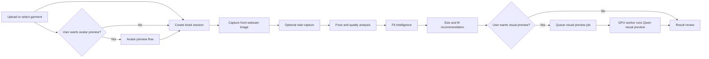
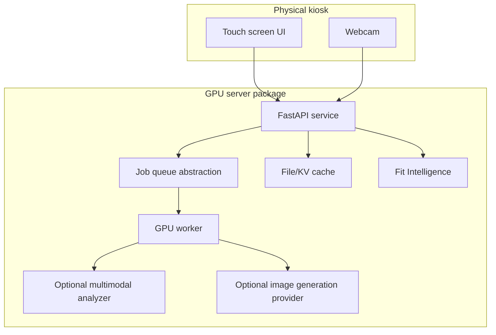

# Kiosk GPU Try-On Flow

This branch introduces the first production boundary for a kiosk-style try-on
deployment. The flow stays sequential, but avatar and generated visual preview
steps are optional. The fit path must not call image generation unless the user
explicitly asks for a visual preview.

## Flow



## Current Swagger Boundary

With `API_PROFILE=kiosk`, Swagger exposes only health and kiosk deployment
endpoints. Legacy/evaluation APIs, including avatar-preview endpoints, remain
available by switching to `API_PROFILE=full` for debugging.

Use `docs/kiosk-swagger-workflow.md` as the manual Swagger checklist for running
the flow end to end.

The current kiosk profile covers deployment readiness, garment registration,
session creation, capture analysis, Fit Intelligence, and optional visual
preview:

- `GET /api/v1/readiness`
  Verifies local storage, SQLite catalogs, job queue paths, and provider config.
  It also pings Ollama `/api/tags` and verifies the configured analyzer model
  is installed without running inference. It returns `503` when the kiosk
  deployment is not ready for a Swagger run.
- `POST /api/v1/kiosk/garments`
  Uploads a garment image and stores its local path and optional size chart in
  the garment registry.
- `POST /api/v1/kiosk/sessions`
  Creates a session. Avatar cache fields are optional.
- `GET /api/v1/kiosk/sessions/{session_id}`
  Loads the current kiosk session state.
- `POST /api/v1/kiosk/sessions/{session_id}/captures`
  Stores front and optional side webcam captures for the next try-on stage.
- `POST /api/v1/kiosk/sessions/{session_id}/captures/analyze`
  Runs MediaPipe-based capture quality and pose checks.
- `POST /api/v1/kiosk/sessions/{session_id}/fit/analyze`
  Runs Fit Intelligence. This endpoint does not call Qwen or generate images.
  It uses the garment's stored size chart unless the request supplies an
  override chart.
- `GET /api/v1/kiosk/sessions/{session_id}/fit/analysis`
  Loads the latest cached Fit Intelligence result attached to the session.
- `POST /api/v1/kiosk/sessions/{session_id}/visual-preview`
  Runs optional Qwen-style visual preview only when the user requests it.
- `POST /api/v1/kiosk/sessions/{session_id}/visual-preview/jobs`
  Queues an optional visual preview job. The job payload stores references
  such as session and garment ids, not image bytes.
- `GET /api/v1/kiosk/jobs/{job_id}`
  Loads the current job status from the configured job backend.

The deprecated `/api/v1/kiosk/sessions/{session_id}/try-on` compatibility route
is still implemented, but it is hidden from the kiosk Swagger surface. Use
`/visual-preview` for all new flows.

## Deployment Shape

For RunPod deployment, use `docs/deployment/runpod-kiosk.md` and
`.env.runpod.example` as the server setup baseline.



## Job Queue Boundary

The queue is intentionally backend-neutral. The current implementation uses a
local JSON backend for development and single-node testing. Production can add
Redis or Kafka backends behind the same `JobQueueBackend` contract, while API
payloads remain stable.

- `JOB_QUEUE_BACKEND=local` stores job metadata under `JOB_QUEUE_DIR`.
- Queue names are capability-oriented, for example `gpu.visual_preview`.
- Job payloads use references only: `session_id`, `garment_id`, category,
  capture keys, and generation options.
- Workers are responsible for loading images through the existing session and
  garment services.
- Jobs can set `max_attempts` for provider timeout or transient GPU failures.
- The local worker recovers stale `running` jobs before polling. By default,
  `python -m scripts.run_kiosk_worker` treats jobs running longer than 30
  minutes as expired, requeues them when attempts remain, and fails them when
  attempts are exhausted.
- Local worker command:

```bash
make worker-once
make worker

python -m scripts.run_kiosk_worker --once
python -m scripts.run_kiosk_worker
```

`--once` is useful for Swagger/local testing: enqueue one visual-preview job,
run the worker once, then inspect `GET /api/v1/kiosk/jobs/{job_id}`.
Use `--stale-running-seconds 0` to disable stale job recovery during debugging.

## Intentional Scope

Fit Intelligence is the primary sizing path. Visual preview is a separate,
optional UX path and must not be treated as measurement truth. The current fit
implementation is still a skeleton and should be extended with real measurement
estimation and size-chart scoring before production size recommendations.

## Baseline Before GPU Deployment

Run the kiosk E2E baseline before deploying a new GPU-server image. The
control-plane baseline does not call visual generation providers.

Before running the baseline, use `GET /api/v1/readiness` or the corresponding
Swagger operation to verify the API can access its local storage, SQLite
catalogs, job queue directory, Ollama analyzer runtime/model, and Replicate
preview config:

```bash
API_PROFILE=kiosk make run
make kiosk-preflight
```

```bash
python -m scripts.run_kiosk_e2e_baseline \
  --front-image /path/to/front.png \
  --side-image /path/to/side.png \
  --garment-image /path/to/garment.png \
  --garment-category tops \
  --garment-type jersey \
  --size-chart-json docs/eval/kiosk_size_chart.example.json \
  --body-measurements-json docs/eval/kiosk_body_measurements.example.json
```

Add `--run-visual-preview` only when you intentionally want to test the
configured image generation model through the local worker.
