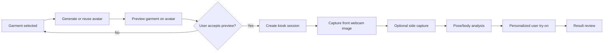
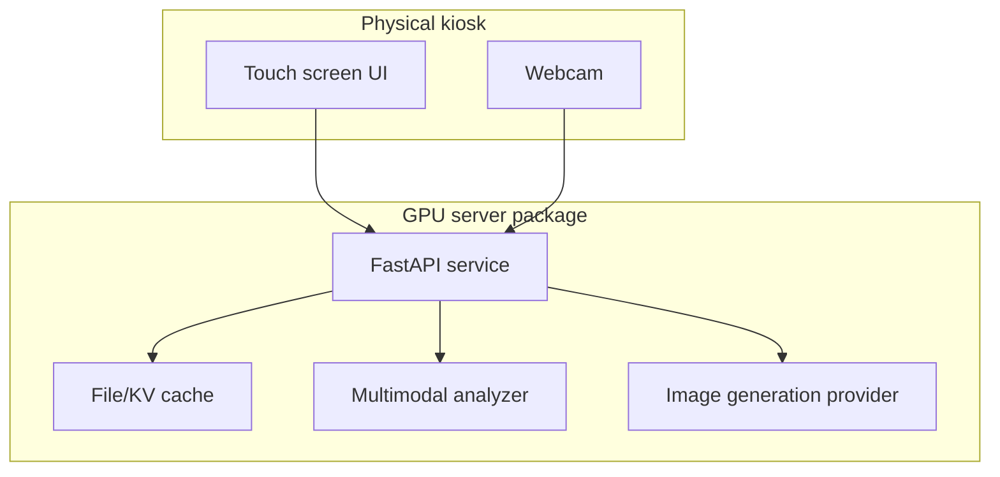

# Kiosk GPU Try-On Flow

This branch introduces the first production boundary for a kiosk-style try-on
deployment. The flow stays sequential: avatar preview first, then real user
capture only after the user accepts the garment direction.

## Flow

## Current API Boundary

The current implementation covers the session boundary between avatar preview
and later personalized try-on:

- `POST /api/v1/kiosk/sessions`
  Creates a session from `avatar_cache_key` and `avatar_preview_cache_key`.
- `GET /api/v1/kiosk/sessions/{session_id}`
  Loads the current kiosk session state.
- `POST /api/v1/kiosk/sessions/{session_id}/captures`
  Stores front and optional side webcam captures for the next try-on stage.

## Deployment Shape

## Intentional Scope

This phase does not implement the final personalized user try-on model call.
It creates durable session state so the next step can attach pose/body analysis
and a GPU-backed try-on provider without changing the avatar preview API.
