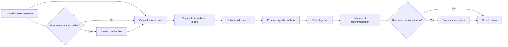
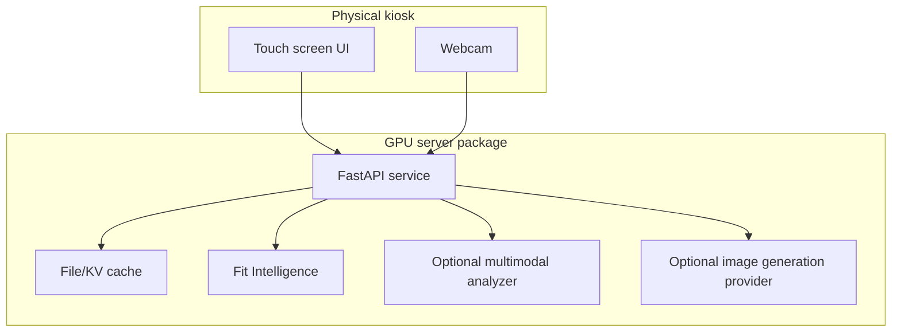

# Kiosk GPU Try-On Flow

This branch introduces the first production boundary for a kiosk-style try-on
deployment. The flow stays sequential, but avatar and generated visual preview
steps are optional. The fit path must not call image generation unless the user
explicitly asks for a visual preview.

## Flow

## Current API Boundary

The current implementation covers garment registration, direct or avatar-assisted
session creation, capture analysis, Fit Intelligence, and optional visual
preview:

- `POST /api/v1/kiosk/garments`
  Uploads a garment image and stores its local path in the garment registry.
- `POST /api/v1/kiosk/sessions`
  Creates a session. Avatar cache fields are optional.
- `GET /api/v1/kiosk/sessions/{session_id}`
  Loads the current kiosk session state.
- `POST /api/v1/kiosk/sessions/{session_id}/captures`
  Stores front and optional side webcam captures for the next try-on stage.
- `POST /api/v1/kiosk/sessions/{session_id}/captures/analyze`
  Runs MediaPipe-based capture quality and pose checks.
- `POST /api/v1/kiosk/sessions/{session_id}/fit/analyze`
  Runs Fit Intelligence. This endpoint does not call Qwen or generate images.
- `POST /api/v1/kiosk/sessions/{session_id}/visual-preview`
  Runs optional Qwen-style visual preview only when the user requests it.
- `POST /api/v1/kiosk/sessions/{session_id}/try-on`
  Deprecated compatibility alias for `visual-preview`.

## Deployment Shape

## Intentional Scope

Fit Intelligence is the primary sizing path. Visual preview is a separate,
optional UX path and must not be treated as measurement truth. The current fit
implementation is still a skeleton and should be extended with real measurement
estimation and size-chart scoring before production size recommendations.
